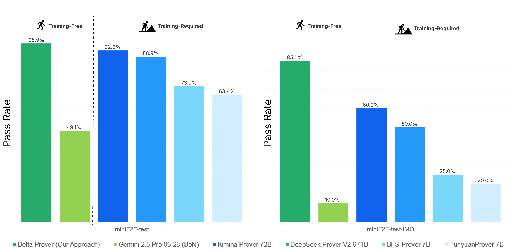
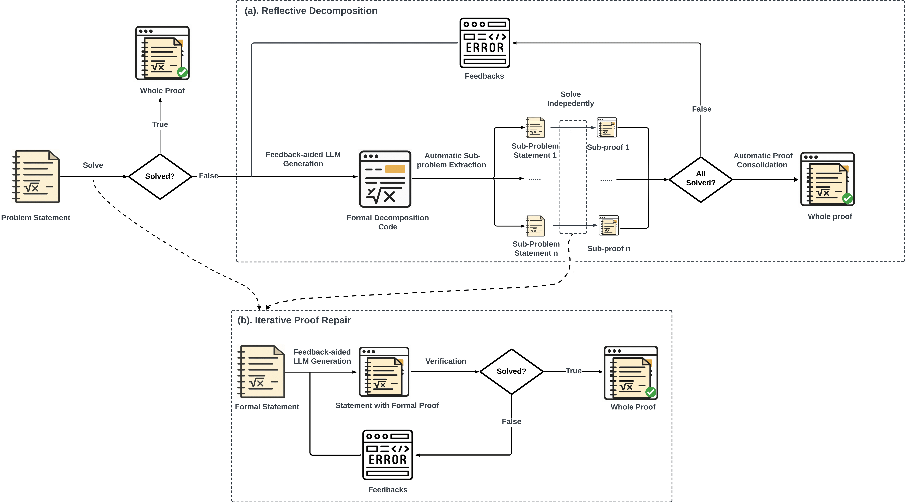

# Solving Formal Math Problems by Decomposition and Iterative Reflection

<div align="center"> 
  <a href="https://arxiv.org/abs/2507.15225"><b>Tech Report</b></a>
</div>

---

🤖 Introducing **Delta Prover**, an agent-based framework that enables general-purpose Large Language Models (LLMs) to solve complex formal proofs in Lean 4, without any model specialization.

- **New State-of-the-Art Performance**: Delta Prover achieves a **95.9%** success rate on the miniF2F-test benchmark, surpassing all existing approaches, including those requiring specialized, fine-tuned models.
- **No Fine-Tuning Required**: By orchestrating the interaction between a general-purpose LLM and the Lean 4 environment, Delta Prover circumvents the need for costly data collection and model training, making powerful theorem proving more accessible.
- **Superior Scaling**: The framework exhibits a significantly stronger test-time scaling law compared to standard Best-of-N proof generation strategies, showcasing a more efficient path to solving harder problems.
- **Agentic Reasoning**: Our findings demonstrate that general-purpose LLMs possess substantial untapped theorem-proving capabilities that can be unlocked when guided by an effective agentic structure, presenting a computationally efficient alternative for robust automated reasoning.

<p align="center">
    
</p>

## Core Components of Delta Prover

At its core, Delta Prover integrates two novel, interdependent components that allow a general-purpose LLM to interactively construct formal proofs.

<p align="center">
  
</p>

- **Reflective Decomposition and Iterative Repair**: An algorithmic framework that empowers the agent to reflect on the current proof state, decompose complex problems into manageable sub-goals, and intelligently repair incorrect proof steps through interaction with the Lean 4 environment.
- **Custom Domain-Specific Language (DSL)**: A purpose-built DSL layered on top of Lean 4, designed to streamline subproblem management. This allows the agent to clearly define, track, and solve intermediate goals within the larger proof structure.


## Citation
```
@article{delta_prover_2025,
	title = {Solving Formal Math Problems by Decomposition and Iterative Reflection},
	author = {Zhou, Yichi and Zhao, Jianqiu and Zhang, Yongxin and Wang, Bohan and Wang, Siran and Chen, Luoxin and Wang, Jiahui and Chen, Haowei and Jie, Allan and Zhang, Xinbo and Wang, Haocheng and Trung, Luong and Ye, Rong and Hoang, Phan Nhat and Zhang, Huishuai and Sun, Peng and Li, Hang},
	year = {2025},
	url = {https://arxiv.org/abs/2507.15225},
}
```
