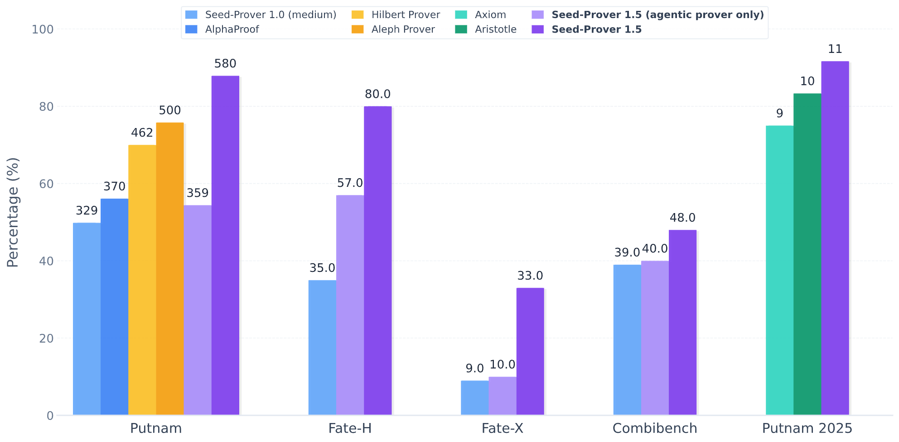

#  Seed-Prover 1.5: Mastering Undergraduate-Level Theorem Proving via Learning from Experience

## Overview

[Arxiv 2512.17260](https://arxiv.org/abs/2512.17260)

Large language models have recently made significant progress to generate rigorous mathematical proofs. In contrast, utilizing LLMs for theorem proving in formal languages (such as Lean) remains challenging and computationally expensive, particularly when addressing problems at the undergraduate level and beyond.

In this work, we present **Seed-Prover 1.5**, a formal theorem-proving model trained via large-scale agentic reinforcement learning, alongside an efficient test-time scaling (TTS) workflow. Through extensive interactions with Lean and other tools, the model continuously accumulates experience during the RL process, substantially enhancing the capability and efficiency of formal theorem proving.

Furthermore, leveraging recent advancements in natural language proving, our TTS workflow efficiently bridges the gap between natural and formal languages.

Compared to state-of-the-art methods, Seed-Prover 1.5 achieves superior performance with a smaller compute budget. It solves **88% of PutnamBench** (undergraduate-level), **80% of Fate-H** (graduate-level), and **33% of Fate-X** (PhD-level) problems. 

We evaluated Seed-Prover 1.5 on the IMO 2025 and Putnam 2025 competition. While Seed-Prover 1.0 required "Heavy" mode to solve 5 out of 6 problems,
Seed-Prover 1.5 achieved the same solve rate using significantly lower compute resources and shorter runtime. We also tested
on the 12 problems from Putnam 2025, Seed Prover 1.5 successfully solved 11 of them within 9 hours.

Our findings suggest that scaling learning from experience, driven by high-quality formal feedback, holds immense potential for the future of formal mathematical reasoning.



## IMO and Putnam 2025
| **IMO 2025**   | **P1** | **P2** | **P3** | **P4** | **P5** | **P6** |
|-----------------|--------|--------|--------|--------|--------|--------|
| **Solve Hour**  | 16.5   | 0.01   | 5      | 8      | 1      | X      |

*P2 is solved by Seed-Geometry

| **Putnam 2025** | **A1** | **A2** | **A3** | **A4** | **A5** | **A6** | **B1** | **B2** | **B3** | **B4** | **B5** | **B6** |
|-----------------|--------|--------|--------|--------|--------|--------|--------|--------|--------|--------|--------|--------|
| **Solve Hour**  | 1      | 0.5    | 2      | 4      | X      | 4      | 9      | 6      | 0.5    | 2      | 4      | 3      |

*Compiled under Lean v4.22.0


## Citation
```
@misc{chen2025seedprover15masteringundergraduatelevel,
      title={Seed-Prover 1.5: Mastering Undergraduate-Level Theorem Proving via Learning from Experience}, 
      author={Jiangjie Chen and Wenxiang Chen and Jiacheng Du and Jinyi Hu and Zhicheng Jiang and Allan Jie and Xiaoran Jin and Xing Jin and Chenggang Li and Wenlei Shi and Zhihong Wang and Mingxuan Wang and Chenrui Wei and Shufa Wei and Huajian Xin and Fan Yang and Weihao Gao and Zheng Yuan and Tianyang Zhan and Zeyu Zheng and Tianxi Zhou and Thomas Hanwen Zhu},
      year={2025},
      eprint={2512.17260},
      archivePrefix={arXiv},
      primaryClass={cs.CL},
      url={https://arxiv.org/abs/2512.17260}, 
}
```
